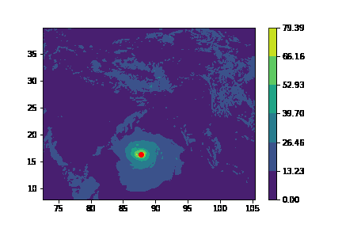
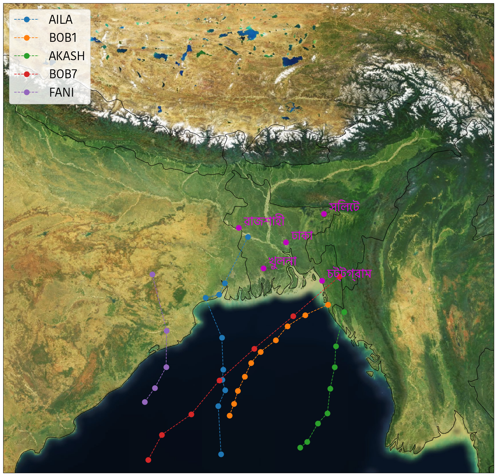

# Overview of Applied Data Science Coursework
This is a file to highlight contributions made by Harry Winer, not discounting efforts made by teammates. 

## Visualisation
Visualisations made with explainability in mind. A priority of the project was to effectively communicate effects of a cyclone to the citizens of Bangladesh. 

This effected the choice of variable, Wind Speed of Gust, as well as the visuals. Major cities were listed to provide concrete conceptual grounding. 

## Centroids
I devised an algorithm based on K-means and GMM to find the centre of a cyclone. A derivation and explanation can be found in [this Jupyter Notebook](../exploration/clustering.ipynb)

### Initial testing

### Full Visualisation
This is a depiction of the paths of all of the cyclones in our dataset

