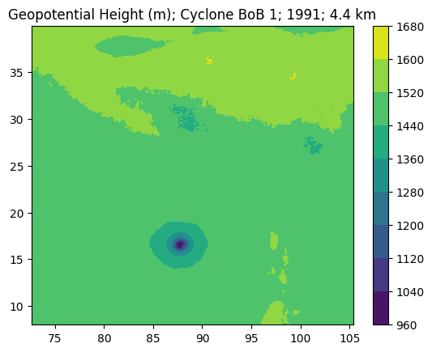
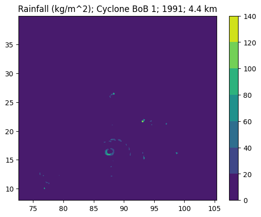
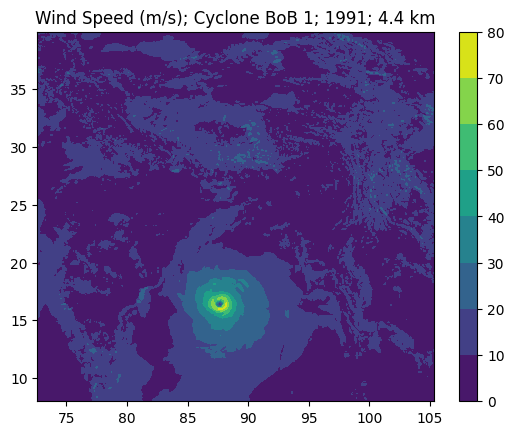
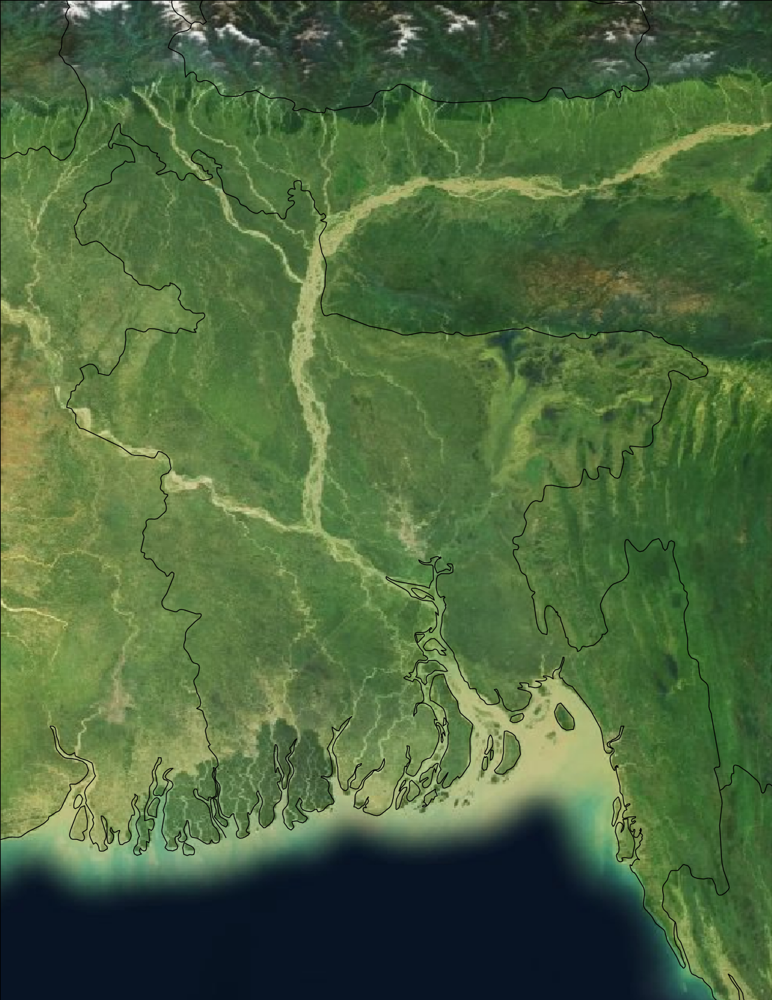

# Report Images

From Section III, examples of basic visualisations:

All frames are taken from TC BoB1, at T-36 hours before the TC makes landfall, which is when the first ensemble begins recording.

Example blank domains:

